# Диаграммы для дипломной работы

Этот файл содержит описание всех диаграмм в формате PlantUML и Mermaid для визуализации в документации.

## Содержание

1. [Рисунок 2.1 — Контекстная диаграмма](#рисунок-21--контекстная-диаграмма)
2. [Рисунок 2.2 — Диаграмма вариантов использования](#рисунок-22--диаграмма-вариантов-использования)
3. [Рисунок 2.3 — Диаграмма состояний заявки](#рисунок-23--диаграмма-состояний-заявки)
4. [Рисунок 2.4 — BPMN-диаграмма процесса обработки заявки](#рисунок-24--bpmn-диаграмма)
5. [Рисунок 2.5 — Компонентная диаграмма](#рисунок-25--компонентная-диаграмма)
6. [Рисунок 2.6 — Диаграмма развертывания](#рисунок-26--диаграмма-развертывания)
7. [Рисунок 2.7 — ER-диаграмма базы данных](#рисунок-27--er-диаграмма)
8. [Рисунок 3.7 — Диаграмма последовательности](#рисунок-37--диаграмма-последовательности)

---

## Рисунок 2.1 — Контекстная диаграмма

**Описание:** Контекстная диаграмма показывает систему управления услугами и её взаимодействие с внешними сущностями.

### PlantUML код:

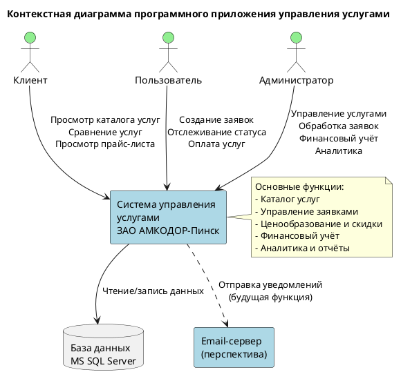
```plantuml
@startuml
!define RECTANGLE class

skinparam rectangle {
    BackgroundColor LightBlue
    BorderColor Black
}

skinparam actor {
    BackgroundColor LightGreen
    BorderColor Black
}

title Контекстная диаграмма программного приложения управления услугами

actor "Клиент" as Client
actor "Пользователь" as User
actor "Администратор" as Admin

rectangle "Система управления\nуслугами\nЗАО АМКОДОР-Пинск" as System {
}

database "База данных\nMS SQL Server" as DB
rectangle "Email-сервер\n(перспектива)" as Email

Client --> System : Просмотр каталога услуг\nСравнение услуг\nПросмотр прайс-листа
User --> System : Создание заявок\nОтслеживание статуса\nОплата услуг
Admin --> System : Управление услугами\nОбработка заявок\nФинансовый учёт\nАналитика

System --> DB : Чтение/запись данных
System ..> Email : Отправка уведомлений\n(будущая функция)

note right of System
  Основные функции:
  - Каталог услуг
  - Управление заявками
  - Ценообразование и скидки
  - Финансовый учёт
  - Аналитика и отчёты
end note

@enduml
```

### Mermaid код:

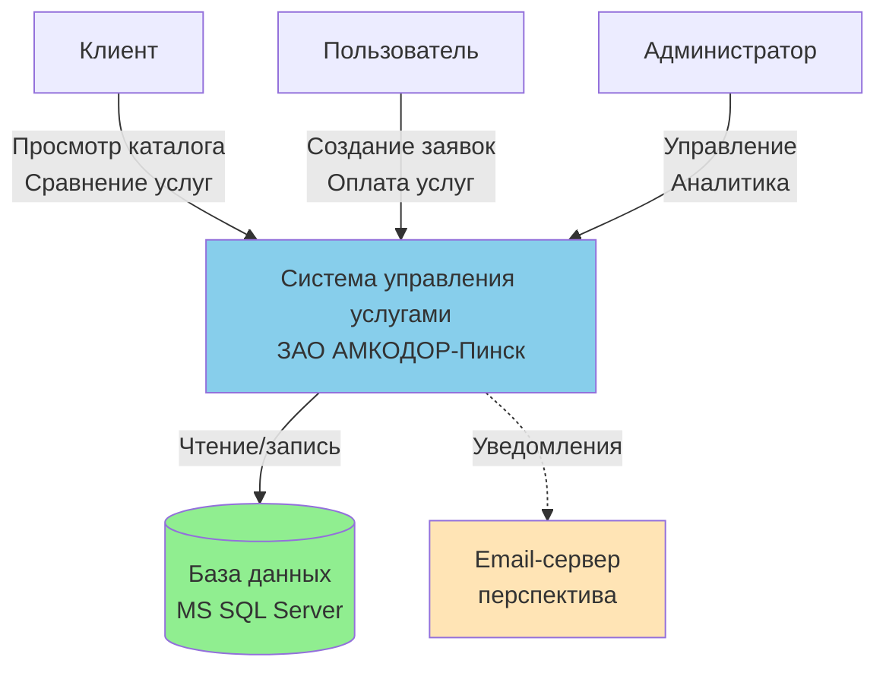
```mermaid
graph TB
    Client[Клиент]
    User[Пользователь]
    Admin[Администратор]
    
    System[Система управления услугами<br/>ЗАО АМКОДОР-Пинск]
    
    DB[(База данных<br/>MS SQL Server)]
    Email[Email-сервер<br/>перспектива]
    
    Client -->|Просмотр каталога<br/>Сравнение услуг| System
    User -->|Создание заявок<br/>Оплата услуг| System
    Admin -->|Управление<br/>Аналитика| System
    
    System -->|Чтение/запись| DB
    System -.->|Уведомления| Email
    
    style System fill:#87CEEB
    style DB fill:#90EE90
    style Email fill:#FFE4B5
```

---

## Рисунок 2.2 — Диаграмма вариантов использования

**Описание:** Use Case диаграмма показывает функциональные возможности системы для разных ролей пользователей.

### PlantUML код:

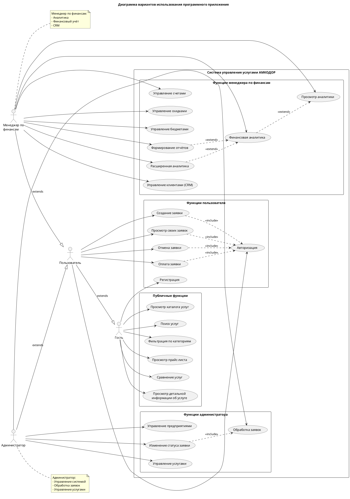
```plantuml
@startuml
left to right direction
skinparam packageStyle rectangle

title Диаграмма вариантов использования программного приложения

actor "Гость" as Guest
actor "Пользователь" as User
actor "Администратор" as Admin
actor "Менеджер по\nфинансам" as Finance

rectangle "Система управления услугами АМКОДОР" {
    
    package "Публичные функции" {
        usecase "Просмотр каталога услуг" as UC1
        usecase "Поиск услуг" as UC2
        usecase "Фильтрация по категориям" as UC3
        usecase "Просмотр прайс-листа" as UC4
        usecase "Сравнение услуг" as UC5
        usecase "Просмотр детальной\nинформации об услуге" as UC6
    }
    
    package "Функции пользователя" {
        usecase "Регистрация" as UC7
        usecase "Авторизация" as UC8
        usecase "Создание заявки" as UC9
        usecase "Просмотр своих заявок" as UC10
        usecase "Отмена заявки" as UC11
        usecase "Оплата заявки" as UC12
    }
    
    package "Функции администратора" {
        usecase "Управление услугами" as UC13
        usecase "Управление предприятиями" as UC14
        usecase "Обработка заявок" as UC15
        usecase "Изменение статуса заявки" as UC16
    }
    
    package "Функции менеджера по финансам" {
        usecase "Просмотр аналитики" as UC17
        usecase "Финансовая аналитика" as UC18
        usecase "Расширенная аналитика" as UC19
        usecase "Управление клиентами (CRM)" as UC20
        usecase "Управление счетами" as UC21
        usecase "Управление скидками" as UC22
        usecase "Управление бюджетами" as UC23
        usecase "Формирование отчётов" as UC24
    }
}

Guest --> UC1
Guest --> UC2
Guest --> UC3
Guest --> UC4
Guest --> UC5
Guest --> UC6
Guest --> UC7

User --> UC8
User --> UC9
User --> UC10
User --> UC11
User --> UC12

Admin --> UC13
Admin --> UC14
Admin --> UC15
Admin --> UC16

Finance --> UC17
Finance --> UC18
Finance --> UC19
Finance --> UC20
Finance --> UC21
Finance --> UC22
Finance --> UC23
Finance --> UC24

User --|> Guest : extends
Admin --|> User : extends
Finance --|> User : extends

UC9 ..> UC8 : <<include>>
UC10 ..> UC8 : <<include>>
UC11 ..> UC8 : <<include>>
UC12 ..> UC8 : <<include>>

UC16 ..> UC15 : <<include>>
UC18 ..> UC17 : <<extend>>
UC19 ..> UC18 : <<extend>>
UC24 ..> UC18 : <<extend>>

note right of Admin
  Администратор:
  - Управление системой
  - Обработка заявок
  - Управление услугами
end note

note right of Finance
  Менеджер по финансам:
  - Аналитика
  - Финансовый учёт
  - CRM
end note

@enduml
```

### Mermaid код:


```mermaid
graph TB
    Guest[Гость]
    User[Пользователь]
    Admin[Администратор]
    Finance[Менеджер по финансам]
    
    subgraph "Публичные функции"
        UC1[Просмотр каталога услуг]
        UC2[Поиск услуг]
        UC3[Фильтрация по категориям]
        UC4[Просмотр прайс-листа]
        UC5[Сравнение услуг]
    end
    
    subgraph "Функции пользователя"
        UC6[Регистрация]
        UC7[Авторизация]
        UC8[Создание заявки]
        UC9[Просмотр своих заявок]
        UC10[Оплата заявки]
    end
    
    subgraph "Функции администратора"
        UC11[Управление услугами]
        UC12[Управление предприятиями]
        UC13[Обработка заявок]
    end
    
    subgraph "Функции менеджера по финансам"
        UC14[Аналитика]
        UC15[Финансовый учёт]
        UC16[CRM: Клиенты]
        UC17[CRM: Счета]
        UC18[CRM: Скидки]
        UC19[CRM: Бюджеты]
    end
    
    Guest --> UC1
    Guest --> UC2
    Guest --> UC3
    Guest --> UC4
    Guest --> UC5
    
    User --> UC6
    User --> UC7
    User --> UC8
    User --> UC9
    User --> UC10
    
    Admin --> UC11
    Admin --> UC12
    Admin --> UC13
    
    Finance --> UC14
    Finance --> UC15
    Finance --> UC16
    Finance --> UC17
    Finance --> UC18
    Finance --> UC19
    
    style Admin fill:#FFB6C1
    style Finance fill:#87CEEB
```

---

## Рисунок 2.3 — Диаграмма состояний заявки

**Описание:** State Machine диаграмма показывает жизненный цикл заявки и переходы между состояниями.

### PlantUML код:

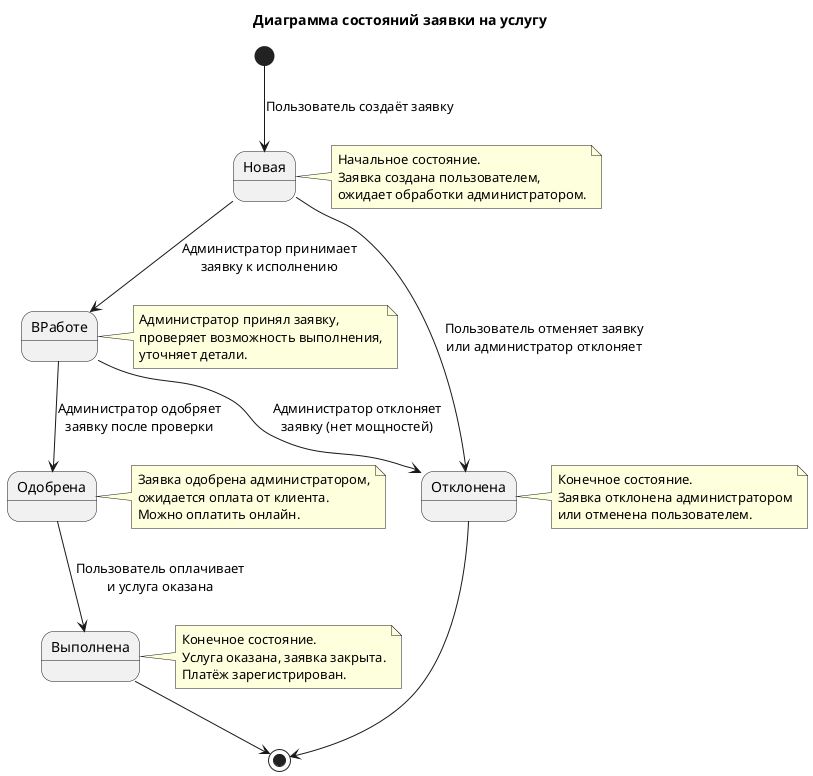
```plantuml
@startuml
title Диаграмма состояний заявки на услугу

[*] --> Новая : Пользователь создаёт заявку

Новая --> ВРаботе : Администратор принимает\nзаявку к исполнению
Новая --> Отклонена : Пользователь отменяет заявку\nили администратор отклоняет

ВРаботе --> Одобрена : Администратор одобряет\nзаявку после проверки
ВРаботе --> Отклонена : Администратор отклоняет\nзаявку (нет мощностей)

Одобрена --> Выполнена : Пользователь оплачивает\nи услуга оказана

Отклонена --> [*]
Выполнена --> [*]

note right of Новая
  Начальное состояние.
  Заявка создана пользователем,
  ожидает обработки администратором.
end note

note right of ВРаботе
  Администратор принял заявку,
  проверяет возможность выполнения,
  уточняет детали.
end note

note right of Одобрена
  Заявка одобрена администратором,
  ожидается оплата от клиента.
  Можно оплатить онлайн.
end note

note right of Отклонена
  Конечное состояние.
  Заявка отклонена администратором
  или отменена пользователем.
end note

note right of Выполнена
  Конечное состояние.
  Услуга оказана, заявка закрыта.
  Платёж зарегистрирован.
end note

@enduml
```

### Mermaid код:

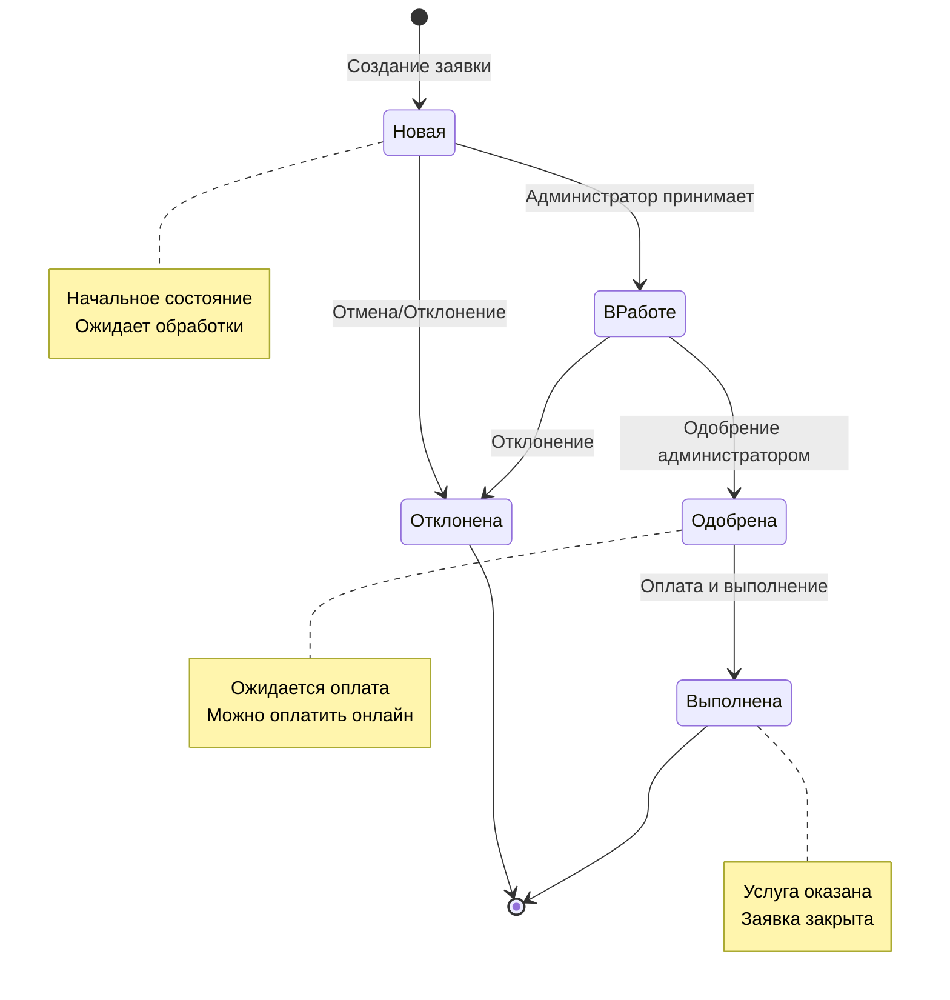
```mermaid
stateDiagram-v2
    [*] --> Новая: Создание заявки
    
    Новая --> ВРаботе: Администратор принимает
    Новая --> Отклонена: Отмена/Отклонение
    
    ВРаботе --> Одобрена: Одобрение администратором
    ВРаботе --> Отклонена: Отклонение
    
    Одобрена --> Выполнена: Оплата и выполнение
    
    Отклонена --> [*]
    Выполнена --> [*]
    
    note right of Новая
        Начальное состояние
        Ожидает обработки
    end note
    
    note right of Одобрена
        Ожидается оплата
        Можно оплатить онлайн
    end note
    
    note right of Выполнена
        Услуга оказана
        Заявка закрыта
    end note
```

---

## Рисунок 2.4 — BPMN-диаграмма

**Описание:** BPMN-диаграмма процесса обработки заявки от создания до завершения.

### PlantUML код:

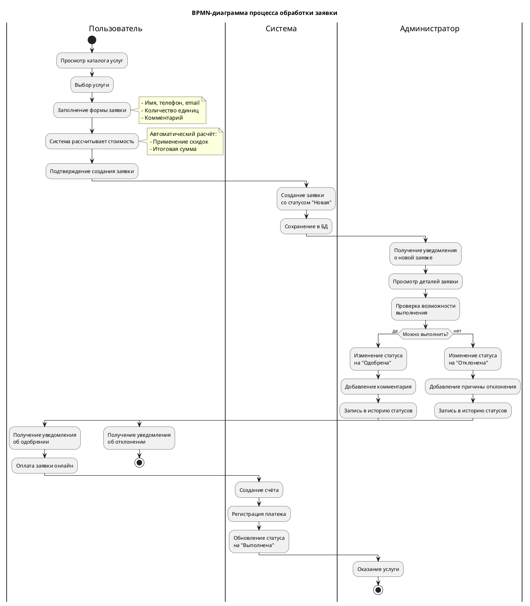
```plantuml
@startuml
title BPMN-диаграмма процесса обработки заявки

|Пользователь|
start
:Просмотр каталога услуг;
:Выбор услуги;
:Заполнение формы заявки;
note right
  - Имя, телефон, email
  - Количество единиц
  - Комментарий
end note
:Система рассчитывает стоимость;
note right
  Автоматический расчёт:
  - Применение скидок
  - Итоговая сумма
end note
:Подтверждение создания заявки;

|Система|
:Создание заявки\nсо статусом "Новая";
:Сохранение в БД;

|Администратор|
:Получение уведомления\nо новой заявке;
:Просмотр деталей заявки;
:Проверка возможности\nвыполнения;

if (Можно выполнить?) then (да)
  :Изменение статуса\nна "Одобрена";
  :Добавление комментария;
  :Запись в историю статусов;
  
  |Пользователь|
  :Получение уведомления\nоб одобрении;
  :Оплата заявки онлайн;
  
  |Система|
  :Создание счёта;
  :Регистрация платежа;
  :Обновление статуса\nна "Выполнена";
  
  |Администратор|
  :Оказание услуги;
  stop
  
else (нет)
  :Изменение статуса\nна "Отклонена";
  :Добавление причины отклонения;
  :Запись в историю статусов;
  
  |Пользователь|
  :Получение уведомления\nоб отклонении;
  stop
endif

@enduml
```

### Текстовое описание BPMN:

```
ПРОЦЕСС: Обработка заявки на услугу

УЧАСТНИКИ:
1. Пользователь
2. Система
3. Администратор

ЭТАПЫ:

[ПОЛЬЗОВАТЕЛЬ]
1. START → Просмотр каталога услуг
2. Выбор услуги
3. Заполнение формы заявки (имя, телефон, количество)
4. Подтверждение создания

[СИСТЕМА]
5. Автоматический расчёт стоимости с применением скидок
6. Создание заявки со статусом "Новая"
7. Сохранение в базу данных

[АДМИНИСТРАТОР]
8. Просмотр новой заявки
9. Проверка возможности выполнения
10. DECISION: Можно выполнить?

   ПУТЬ A (ДА):
   11a. Изменение статуса на "Одобрена"
   12a. Добавление комментария
   13a. [ПОЛЬЗОВАТЕЛЬ] Оплата заявки
   14a. [СИСТЕМА] Создание счёта и регистрация платежа
   15a. [АДМИНИСТРАТОР] Оказание услуги
   16a. Статус "Выполнена" → END
   
   ПУТЬ B (НЕТ):
   11b. Изменение статуса на "Отклонена"
   12b. Добавление причины отклонения
   13b. [ПОЛЬЗОВАТЕЛЬ] Получение уведомления → END
```

---


## Рисунок 2.5 — Компонентная диаграмма

**Описание:** Компонентная диаграмма показывает архитектуру приложения и взаимодействие компонентов.

### PlantUML код:

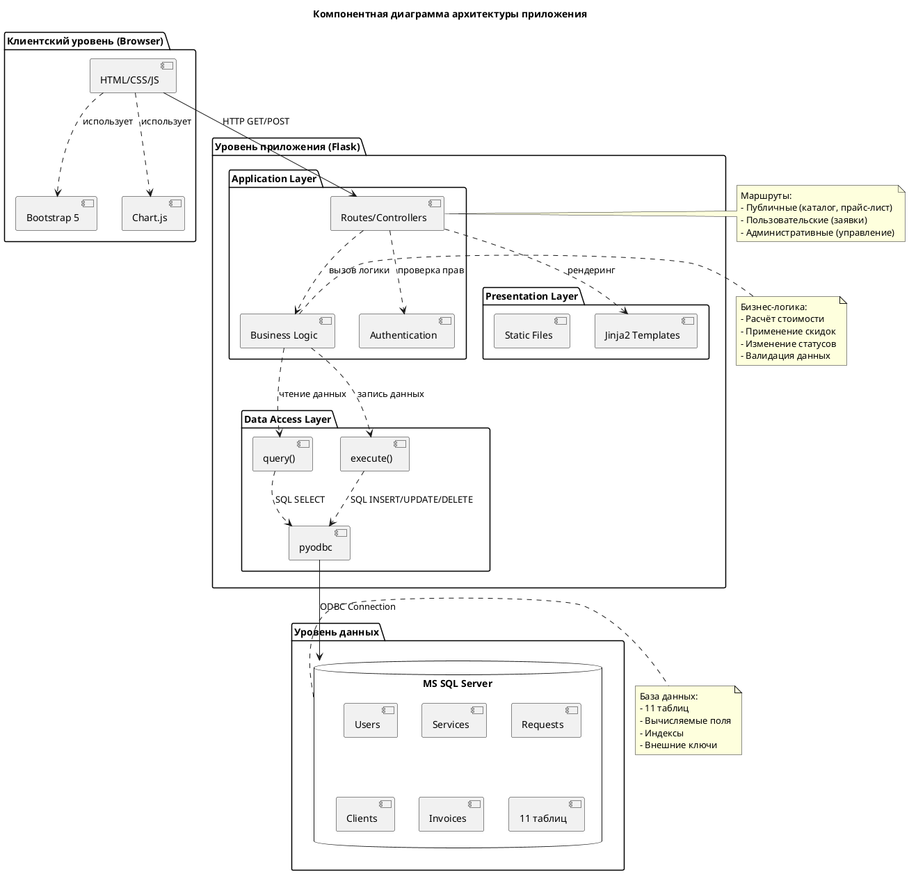
```plantuml
@startuml
title Компонентная диаграмма архитектуры приложения

package "Клиентский уровень (Browser)" {
    component [HTML/CSS/JS] as Frontend
    component [Bootstrap 5] as Bootstrap
    component [Chart.js] as Charts
    
    Frontend ..> Bootstrap : использует
    Frontend ..> Charts : использует
}

package "Уровень приложения (Flask)" {
    
    package "Presentation Layer" {
        component [Jinja2 Templates] as Templates
        component [Static Files] as Static
    }
    
    package "Application Layer" {
        component [Routes/Controllers] as Routes
        component [Authentication] as Auth
        component [Business Logic] as BL
    }
    
    package "Data Access Layer" {
        component [query()] as Query
        component [execute()] as Execute
        component [pyodbc] as PyODBC
    }
    
    Routes ..> Templates : рендеринг
    Routes ..> Auth : проверка прав
    Routes ..> BL : вызов логики
    BL ..> Query : чтение данных
    BL ..> Execute : запись данных
    Query ..> PyODBC : SQL SELECT
    Execute ..> PyODBC : SQL INSERT/UPDATE/DELETE
}

package "Уровень данных" {
    database "MS SQL Server" as DB {
        component [Users] as TUsers
        component [Services] as TServices
        component [Requests] as TRequests
        component [Clients] as TClients
        component [Invoices] as TInvoices
        component [11 таблиц] as Tables
    }
}

Frontend --> Routes : HTTP GET/POST
PyODBC --> DB : ODBC Connection

note right of Routes
  Маршруты:
  - Публичные (каталог, прайс-лист)
  - Пользовательские (заявки)
  - Административные (управление)
end note

note right of BL
  Бизнес-логика:
  - Расчёт стоимости
  - Применение скидок
  - Изменение статусов
  - Валидация данных
end note

note right of DB
  База данных:
  - 11 таблиц
  - Вычисляемые поля
  - Индексы
  - Внешние ключи
end note

@enduml
```

### Mermaid код:

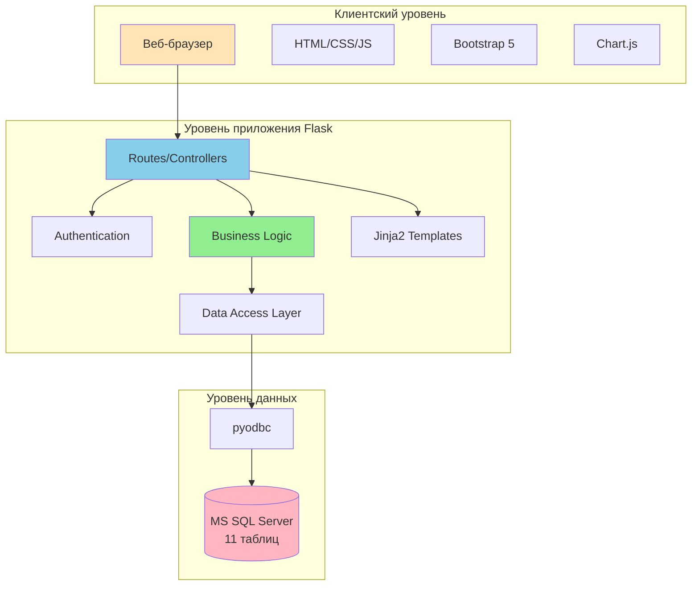
```mermaid
graph TB
    subgraph "Клиентский уровень"
        Browser[Веб-браузер]
        HTML[HTML/CSS/JS]
        Bootstrap[Bootstrap 5]
        Charts[Chart.js]
    end
    
    subgraph "Уровень приложения Flask"
        Routes[Routes/Controllers]
        Auth[Authentication]
        BL[Business Logic]
        Templates[Jinja2 Templates]
        DAL[Data Access Layer]
    end
    
    subgraph "Уровень данных"
        PyODBC[pyodbc]
        DB[(MS SQL Server<br/>11 таблиц)]
    end
    
    Browser --> Routes
    Routes --> Auth
    Routes --> BL
    Routes --> Templates
    BL --> DAL
    DAL --> PyODBC
    PyODBC --> DB
    
    style Browser fill:#FFE4B5
    style Routes fill:#87CEEB
    style BL fill:#90EE90
    style DB fill:#FFB6C1
```

---

## Рисунок 2.6 — Диаграмма развертывания

**Описание:** Deployment диаграмма показывает физическое размещение компонентов системы.

### PlantUML код:

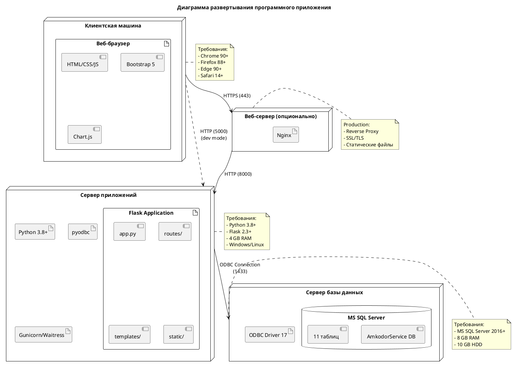
```plantuml
@startuml
title Диаграмма развертывания программного приложения

node "Клиентская машина" as ClientNode {
    artifact "Веб-браузер" as Browser {
        component "HTML/CSS/JS" as Frontend
        component "Bootstrap 5" as BS
        component "Chart.js" as Charts
    }
}

node "Сервер приложений" as AppServer {
    artifact "Flask Application" as FlaskApp {
        component "app.py" as MainApp
        component "routes/" as Routes
        component "templates/" as Templates
        component "static/" as Static
    }
    
    artifact "Python 3.8+" as Python
    artifact "pyodbc" as PyODBC
    artifact "Gunicorn/Waitress" as WSGI
}

node "Сервер базы данных" as DBServer {
    database "MS SQL Server" as MSSQL {
        component "AmkodorService DB" as DB
        component "11 таблиц" as Tables
    }
    
    artifact "ODBC Driver 17" as ODBC
}

node "Веб-сервер (опционально)" as WebServer {
    artifact "Nginx" as Nginx
}

ClientNode -down-> WebServer : HTTPS (443)
WebServer -down-> AppServer : HTTP (8000)
ClientNode ..> AppServer : HTTP (5000)\n(dev mode)

AppServer -down-> DBServer : ODBC Connection\n(1433)

note right of ClientNode
  Требования:
  - Chrome 90+
  - Firefox 88+
  - Edge 90+
  - Safari 14+
end note

note right of AppServer
  Требования:
  - Python 3.8+
  - Flask 2.3+
  - 4 GB RAM
  - Windows/Linux
end note

note right of DBServer
  Требования:
  - MS SQL Server 2016+
  - 8 GB RAM
  - 10 GB HDD
end note

note right of WebServer
  Production:
  - Reverse Proxy
  - SSL/TLS
  - Статические файлы
end note

@enduml
```

### Mermaid код:

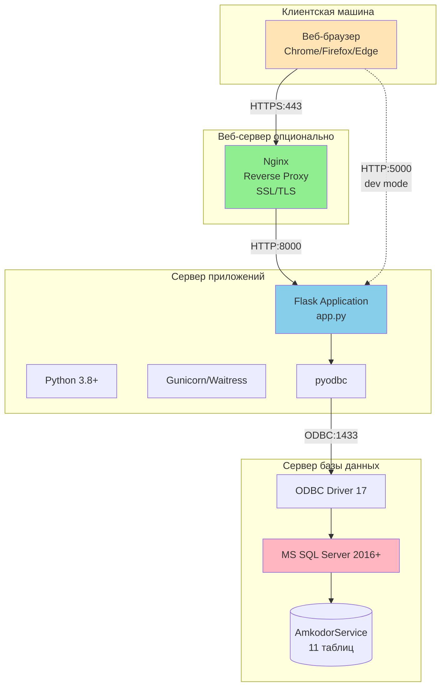
```mermaid
graph TB
    subgraph "Клиентская машина"
        Browser[Веб-браузер<br/>Chrome/Firefox/Edge]
    end
    
    subgraph "Веб-сервер опционально"
        Nginx[Nginx<br/>Reverse Proxy<br/>SSL/TLS]
    end
    
    subgraph "Сервер приложений"
        Flask[Flask Application<br/>app.py]
        Python[Python 3.8+]
        WSGI[Gunicorn/Waitress]
        PyODBC[pyodbc]
    end
    
    subgraph "Сервер базы данных"
        MSSQL[MS SQL Server 2016+]
        DB[(AmkodorService<br/>11 таблиц)]
        ODBC[ODBC Driver 17]
    end
    
    Browser -->|HTTPS:443| Nginx
    Nginx -->|HTTP:8000| Flask
    Browser -.->|HTTP:5000<br/>dev mode| Flask
    
    Flask --> PyODBC
    PyODBC -->|ODBC:1433| ODBC
    ODBC --> MSSQL
    MSSQL --> DB
    
    style Browser fill:#FFE4B5
    style Nginx fill:#90EE90
    style Flask fill:#87CEEB
    style MSSQL fill:#FFB6C1
```

---

## Рисунок 2.7 — ER-диаграмма базы данных

**Описание:** Entity-Relationship диаграмма показывает структуру базы данных и связи между таблицами.

### PlantUML код:

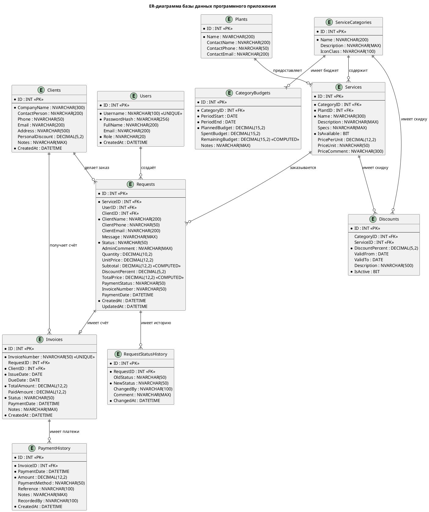
```plantuml
@startuml
title ER-диаграмма базы данных программного приложения

entity "Users" as users {
  * ID : INT <<PK>>
  --
  * Username : NVARCHAR(100) <<UNIQUE>>
  * PasswordHash : NVARCHAR(256)
  FullName : NVARCHAR(200)
  Email : NVARCHAR(200)
  * Role : NVARCHAR(20)
  * CreatedAt : DATETIME
}

entity "ServiceCategories" as categories {
  * ID : INT <<PK>>
  --
  * Name : NVARCHAR(200)
  Description : NVARCHAR(MAX)
  IconClass : NVARCHAR(100)
}

entity "Plants" as plants {
  * ID : INT <<PK>>
  --
  * Name : NVARCHAR(200)
  ContactName : NVARCHAR(200)
  ContactPhone : NVARCHAR(50)
  ContactEmail : NVARCHAR(200)
}

entity "Services" as services {
  * ID : INT <<PK>>
  --
  * CategoryID : INT <<FK>>
  * PlantID : INT <<FK>>
  * Name : NVARCHAR(300)
  Description : NVARCHAR(MAX)
  Specs : NVARCHAR(MAX)
  * IsAvailable : BIT
  PricePerUnit : DECIMAL(12,2)
  PriceUnit : NVARCHAR(50)
  PriceComment : NVARCHAR(300)
}

entity "Requests" as requests {
  * ID : INT <<PK>>
  --
  * ServiceID : INT <<FK>>
  UserID : INT <<FK>>
  ClientID : INT <<FK>>
  * ClientName : NVARCHAR(200)
  ClientPhone : NVARCHAR(50)
  ClientEmail : NVARCHAR(200)
  Message : NVARCHAR(MAX)
  * Status : NVARCHAR(50)
  AdminComment : NVARCHAR(MAX)
  Quantity : DECIMAL(10,2)
  UnitPrice : DECIMAL(12,2)
  Subtotal : DECIMAL(12,2) <<COMPUTED>>
  DiscountPercent : DECIMAL(5,2)
  TotalPrice : DECIMAL(12,2) <<COMPUTED>>
  PaymentStatus : NVARCHAR(50)
  InvoiceNumber : NVARCHAR(50)
  PaymentDate : DATETIME
  * CreatedAt : DATETIME
  UpdatedAt : DATETIME
}

entity "RequestStatusHistory" as history {
  * ID : INT <<PK>>
  --
  * RequestID : INT <<FK>>
  OldStatus : NVARCHAR(50)
  * NewStatus : NVARCHAR(50)
  ChangedBy : NVARCHAR(100)
  Comment : NVARCHAR(MAX)
  * ChangedAt : DATETIME
}

entity "Clients" as clients {
  * ID : INT <<PK>>
  --
  * CompanyName : NVARCHAR(300)
  ContactPerson : NVARCHAR(200)
  Phone : NVARCHAR(50)
  Email : NVARCHAR(200)
  Address : NVARCHAR(500)
  PersonalDiscount : DECIMAL(5,2)
  Notes : NVARCHAR(MAX)
  * CreatedAt : DATETIME
}

entity "Invoices" as invoices {
  * ID : INT <<PK>>
  --
  * InvoiceNumber : NVARCHAR(50) <<UNIQUE>>
  RequestID : INT <<FK>>
  * ClientID : INT <<FK>>
  * IssueDate : DATE
  DueDate : DATE
  * TotalAmount : DECIMAL(12,2)
  PaidAmount : DECIMAL(12,2)
  * Status : NVARCHAR(50)
  PaymentDate : DATETIME
  Notes : NVARCHAR(MAX)
  * CreatedAt : DATETIME
}

entity "PaymentHistory" as payments {
  * ID : INT <<PK>>
  --
  * InvoiceID : INT <<FK>>
  * PaymentDate : DATETIME
  * Amount : DECIMAL(12,2)
  PaymentMethod : NVARCHAR(50)
  Reference : NVARCHAR(100)
  Notes : NVARCHAR(MAX)
  RecordedBy : NVARCHAR(100)
  * CreatedAt : DATETIME
}

entity "Discounts" as discounts {
  * ID : INT <<PK>>
  --
  CategoryID : INT <<FK>>
  ServiceID : INT <<FK>>
  * DiscountPercent : DECIMAL(5,2)
  ValidFrom : DATE
  ValidTo : DATE
  Description : NVARCHAR(500)
  * IsActive : BIT
}

entity "CategoryBudgets" as budgets {
  * ID : INT <<PK>>
  --
  * CategoryID : INT <<FK>>
  * PeriodStart : DATE
  * PeriodEnd : DATE
  * PlannedBudget : DECIMAL(15,2)
  SpentBudget : DECIMAL(15,2)
  RemainingBudget : DECIMAL(15,2) <<COMPUTED>>
  Notes : NVARCHAR(MAX)
}

' Связи
users ||--o{ requests : "создаёт"
categories ||--o{ services : "содержит"
categories ||--o{ budgets : "имеет бюджет"
categories ||--o{ discounts : "имеет скидку"
plants ||--o{ services : "предоставляет"
services ||--o{ requests : "заказывается"
services ||--o{ discounts : "имеет скидку"
requests ||--o{ history : "имеет историю"
requests ||--o| invoices : "имеет счёт"
clients ||--o{ requests : "делает заказ"
clients ||--o{ invoices : "получает счёт"
invoices ||--o{ payments : "имеет платежи"

@enduml
```

### Упрощённая Mermaid версия:

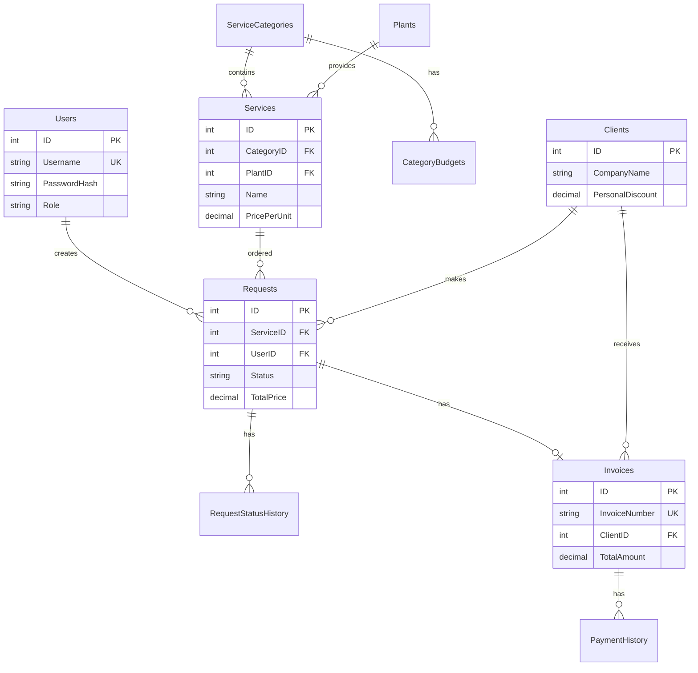
```mermaid
erDiagram
    Users ||--o{ Requests : creates
    ServiceCategories ||--o{ Services : contains
    ServiceCategories ||--o{ CategoryBudgets : has
    Plants ||--o{ Services : provides
    Services ||--o{ Requests : ordered
    Requests ||--o{ RequestStatusHistory : has
    Requests ||--o| Invoices : has
    Clients ||--o{ Requests : makes
    Clients ||--o{ Invoices : receives
    Invoices ||--o{ PaymentHistory : has
    
    Users {
        int ID PK
        string Username UK
        string PasswordHash
        string Role
    }
    
    Services {
        int ID PK
        int CategoryID FK
        int PlantID FK
        string Name
        decimal PricePerUnit
    }
    
    Requests {
        int ID PK
        int ServiceID FK
        int UserID FK
        string Status
        decimal TotalPrice
    }
    
    Clients {
        int ID PK
        string CompanyName
        decimal PersonalDiscount
    }
    
    Invoices {
        int ID PK
        string InvoiceNumber UK
        int ClientID FK
        decimal TotalAmount
    }
```

---

## Рисунок 3.7 — Диаграмма последовательности

**Описание:** Sequence диаграмма показывает взаимодействие компонентов при обработке пользовательской заявки.

### PlantUML код:

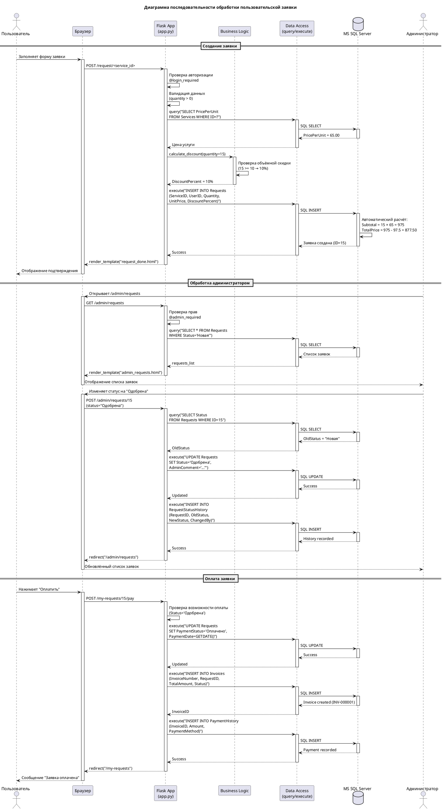
```plantuml
@startuml
title Диаграмма последовательности обработки пользовательской заявки

actor "Пользователь" as User
participant "Браузер" as Browser
participant "Flask App\n(app.py)" as Flask
participant "Business Logic" as BL
participant "Data Access\n(query/execute)" as DAL
database "MS SQL Server" as DB

== Создание заявки ==

User -> Browser : Заполняет форму заявки
activate Browser

Browser -> Flask : POST /request/<service_id>
activate Flask

Flask -> Flask : Проверка авторизации\n@login_required
Flask -> Flask : Валидация данных\n(quantity > 0)

Flask -> DAL : query("SELECT PricePerUnit\nFROM Services WHERE ID=?")
activate DAL
DAL -> DB : SQL SELECT
activate DB
DB --> DAL : PricePerUnit = 65.00
deactivate DB
DAL --> Flask : Цена услуги
deactivate DAL

Flask -> BL : calculate_discount(quantity=15)
activate BL
BL -> BL : Проверка объёмной скидки\n(15 >= 10 → 10%)
BL --> Flask : DiscountPercent = 10%
deactivate BL

Flask -> DAL : execute("INSERT INTO Requests\n(ServiceID, UserID, Quantity,\nUnitPrice, DiscountPercent)")
activate DAL
DAL -> DB : SQL INSERT
activate DB
DB -> DB : Автоматический расчёт:\nSubtotal = 15 × 65 = 975\nTotalPrice = 975 - 97.5 = 877.50
DB --> DAL : Заявка создана (ID=15)
deactivate DB
DAL --> Flask : Success
deactivate DAL

Flask --> Browser : render_template("request_done.html")
deactivate Flask
Browser --> User : Отображение подтверждения
deactivate Browser

== Обработка администратором ==

actor "Администратор" as Admin
Admin -> Browser : Открывает /admin/requests
activate Browser

Browser -> Flask : GET /admin/requests
activate Flask

Flask -> Flask : Проверка прав\n@admin_required

Flask -> DAL : query("SELECT * FROM Requests\nWHERE Status='Новая'")
activate DAL
DAL -> DB : SQL SELECT
activate DB
DB --> DAL : Список заявок
deactivate DB
DAL --> Flask : requests_list
deactivate DAL

Flask --> Browser : render_template("admin_requests.html")
deactivate Flask
Browser --> Admin : Отображение списка заявок
deactivate Browser

Admin -> Browser : Изменяет статус на "Одобрена"
activate Browser

Browser -> Flask : POST /admin/requests/15\n(status="Одобрена")
activate Flask

Flask -> DAL : query("SELECT Status\nFROM Requests WHERE ID=15")
activate DAL
DAL -> DB : SQL SELECT
activate DB
DB --> DAL : OldStatus = "Новая"
deactivate DB
DAL --> Flask : OldStatus
deactivate DAL

Flask -> DAL : execute("UPDATE Requests\nSET Status='Одобрена',\nAdminComment='...'")
activate DAL
DAL -> DB : SQL UPDATE
activate DB
DB --> DAL : Success
deactivate DB
DAL --> Flask : Updated
deactivate DAL

Flask -> DAL : execute("INSERT INTO\nRequestStatusHistory\n(RequestID, OldStatus,\nNewStatus, ChangedBy)")
activate DAL
DAL -> DB : SQL INSERT
activate DB
DB --> DAL : History recorded
deactivate DB
DAL --> Flask : Success
deactivate DAL

Flask --> Browser : redirect("/admin/requests")
deactivate Flask
Browser --> Admin : Обновлённый список заявок
deactivate Browser

== Оплата заявки ==

User -> Browser : Нажимает "Оплатить"
activate Browser

Browser -> Flask : POST /my-requests/15/pay
activate Flask

Flask -> Flask : Проверка возможности оплаты\n(Status='Одобрена')

Flask -> DAL : execute("UPDATE Requests\nSET PaymentStatus='Оплачено',\nPaymentDate=GETDATE()")
activate DAL
DAL -> DB : SQL UPDATE
activate DB
DB --> DAL : Success
deactivate DB
DAL --> Flask : Updated
deactivate DAL

Flask -> DAL : execute("INSERT INTO Invoices\n(InvoiceNumber, RequestID,\nTotalAmount, Status)")
activate DAL
DAL -> DB : SQL INSERT
activate DB
DB --> DAL : Invoice created (INV-000001)
deactivate DB
DAL --> Flask : InvoiceID
deactivate DAL

Flask -> DAL : execute("INSERT INTO PaymentHistory\n(InvoiceID, Amount,\nPaymentMethod)")
activate DAL
DAL -> DB : SQL INSERT
activate DB
DB --> DAL : Payment recorded
deactivate DB
DAL --> Flask : Success
deactivate DAL

Flask --> Browser : redirect("/my-requests")
deactivate Flask
Browser --> User : Сообщение "Заявка оплачена"
deactivate Browser

@enduml
```

### Упрощённая Mermaid версия:

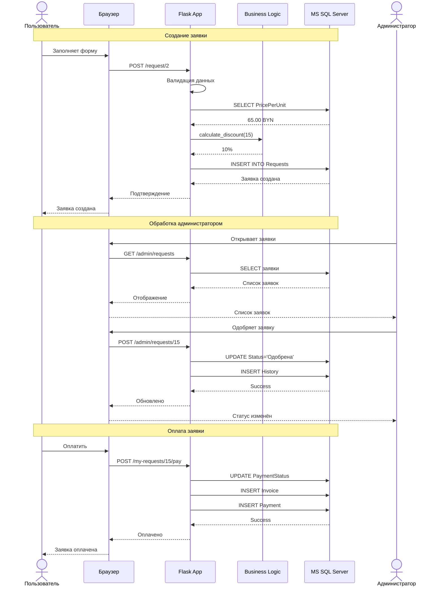
```mermaid
sequenceDiagram
    actor User as Пользователь
    participant Browser as Браузер
    participant Flask as Flask App
    participant BL as Business Logic
    participant DB as MS SQL Server
    
    Note over User,DB: Создание заявки
    
    User->>Browser: Заполняет форму
    Browser->>Flask: POST /request/2
    Flask->>Flask: Валидация данных
    Flask->>DB: SELECT PricePerUnit
    DB-->>Flask: 65.00 BYN
    Flask->>BL: calculate_discount(15)
    BL-->>Flask: 10%
    Flask->>DB: INSERT INTO Requests
    DB-->>Flask: Заявка создана
    Flask-->>Browser: Подтверждение
    Browser-->>User: Заявка создана
    
    Note over User,DB: Обработка администратором
    
    actor Admin as Администратор
    Admin->>Browser: Открывает заявки
    Browser->>Flask: GET /admin/requests
    Flask->>DB: SELECT заявки
    DB-->>Flask: Список заявок
    Flask-->>Browser: Отображение
    Browser-->>Admin: Список заявок
    
    Admin->>Browser: Одобряет заявку
    Browser->>Flask: POST /admin/requests/15
    Flask->>DB: UPDATE Status='Одобрена'
    Flask->>DB: INSERT History
    DB-->>Flask: Success
    Flask-->>Browser: Обновлено
    Browser-->>Admin: Статус изменён
    
    Note over User,DB: Оплата заявки
    
    User->>Browser: Оплатить
    Browser->>Flask: POST /my-requests/15/pay
    Flask->>DB: UPDATE PaymentStatus
    Flask->>DB: INSERT Invoice
    Flask->>DB: INSERT Payment
    DB-->>Flask: Success
    Flask-->>Browser: Оплачено
    Browser-->>User: Заявка оплачена
```

---

## Инструкции по использованию диаграмм

### Для PlantUML:

1. Установите PlantUML: https://plantuml.com/download
2. Или используйте онлайн-редактор: https://www.plantuml.com/plantuml/uml/
3. Скопируйте код диаграммы
4. Сгенерируйте изображение (PNG, SVG, PDF)

### Для Mermaid:

1. Используйте онлайн-редактор: https://mermaid.live/
2. Или установите расширение для VS Code: "Mermaid Preview"
3. Скопируйте код диаграммы
4. Экспортируйте в PNG или SVG

### Для вставки в Word/документ:

1. Сгенерируйте изображение из PlantUML/Mermaid
2. Сохраните как PNG или SVG (высокое качество)
3. Вставьте в документ
4. Добавьте подпись: "Рисунок X.X — Название диаграммы"

---

## Примечания

- Все диаграммы соответствуют стандартам UML 2.5
- BPMN-диаграмма соответствует стандарту BPMN 2.0
- ER-диаграмма использует нотацию Crow's Foot
- Диаграммы можно редактировать и адаптировать под требования
- Рекомендуется использовать векторный формат (SVG) для печати

---

**Дата создания:** 2024  
**Автор:** [Ваше имя]  
**Проект:** Система управления услугами ЗАО «АМКОДОР-Пинск»
